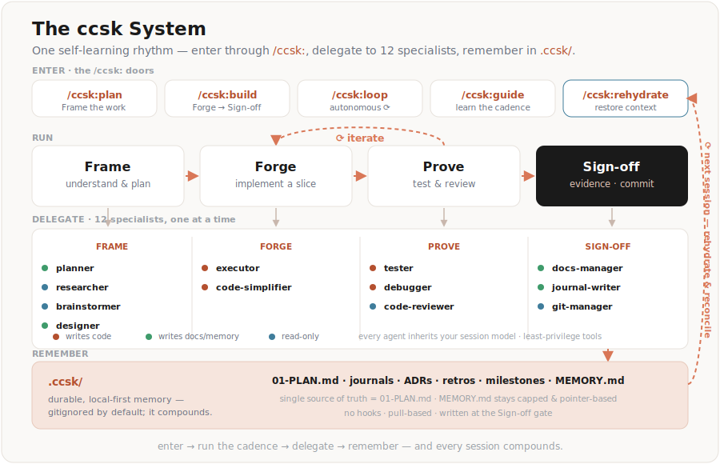
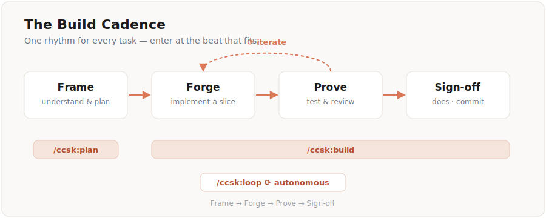
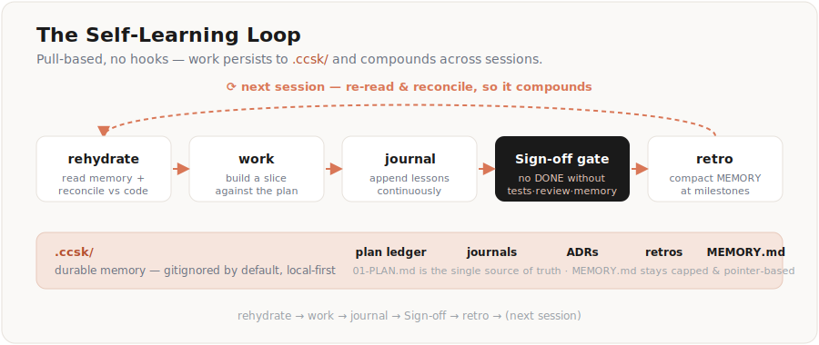
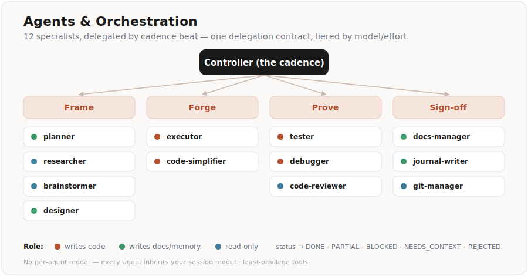
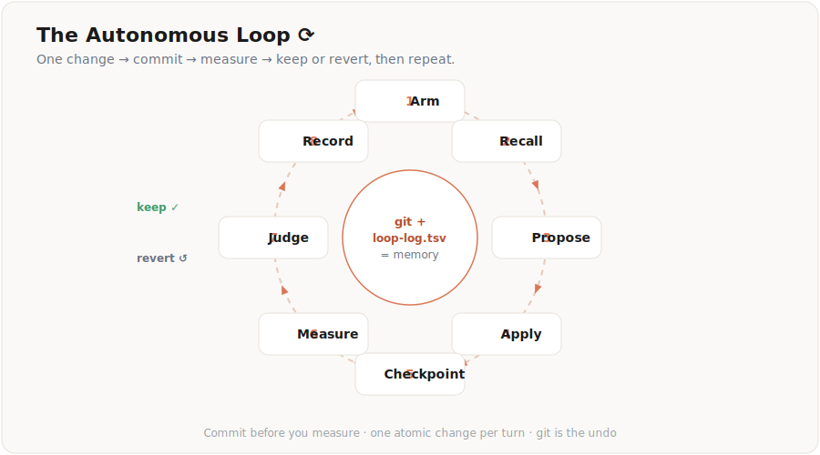

<div align="center">

# ccsk-kit

**Build software in one rhythm — and let it learn as it goes.**

`Frame → Forge → Prove → Sign-off`

<sub>**Plugin · `/ccsk:` commands · 16 Skills · 12 Agents · 7 Rules · self-learning memory**</sub>


> A lean, **pure-markdown** Claude Code kit shipped as a **plugin**: one Build Cadence, `/ccsk:` workflow commands, a focused specialist roster, an autonomous optimization loop, and a self-learning memory loop that compounds across sessions. No hooks, no Node scripts, no multi-model machinery — nothing to break silently.

</div>

<div align="center">

</div>

> [!IMPORTANT]
> **This is `v2.0.0-beta-02` — a prerelease.** v2 is a ground-up rebuild (plugin distribution + `/ccsk:` colon commands + a self-learning memory loop). The latest **stable** kit is **v1.1.0** (older `/ccsk-plan` hyphen commands), so a default `ccsk init` installs **v1.1.0**. To get v2, opt in:
> `ccsk init --pre` · `ccsk init --version 2.0.0-beta-02` · or pick it in the `ccsk init` version picker.
> (Installing the plugin directly from `main` — see below — also gives you v2.)

---

## Highlights

- ✅ **One rhythm for everything** — every task follows the **Build Cadence**, so you always know the next move.
- 🧠 **Self-learning, pull-based** — work persists to `.ccsk/` (plan ledger, journals, retros, ADRs, milestones, `MEMORY.md`); `/ccsk:rehydrate` reads it back and reconciles against the code, so sessions compound instead of starting cold. No hooks required.
- ♻️ **Approve once, then let it run** — gated autonomy self-drives the cadence and pauses only at the human-owned gates (clarify · destructive ops · push). The `/ccsk:loop` improves a metric on its own, keeping only what provably helps.
- 🔒 **Verifiable Sign-off** — a task can't be "done" without test evidence + a **separate-reviewer** verdict + the memory write-back. Safety lives in a never-auto denylist, inlined where it acts.
- 👥 **12 specialist agents** — planner, executor, reviewer, tester, debugger, designer, and more — each a narrow remit, least-privilege tools, model-agnostic.
- 🧩 **A real delegation contract** — every subagent gets a complete packet and returns a typed status; file-ownership rules keep parallel work collision-free.
- 🪶 **Pure markdown** — behavior lives in skills, agents, and rules. Portable, transparent, diffable.

---

## How it works

### The Build Cadence

Every non-trivial task moves through four beats. Enter at the one that fits — the `/ccsk:` commands are the doors.

<div align="center">

</div>

| Situation | Enter at | Command |
|---|---|---|
| Scope unclear, multi-phase, or risky | **Frame** | `/ccsk:plan` |
| A plan exists, or scope is clear | **Forge** | `/ccsk:build` |
| Improving one measurable metric repeatedly | **Loop** | `/ccsk:loop` |
| Resuming work / after compaction | (pre-flight) | `/ccsk:rehydrate` |
| Need options before committing | pre-Frame | `/ccsk:brainstorm` |
| Learning the method, or want a worked example | (any time) | `/ccsk:guide` |

### The self-learning loop

Memory is plain markdown under `.ccsk/` (gitignored by default — local-only; opt in to commit for team sharing). `MEMORY.md` stays small (capped, pointer-based); journals are append-only; the plan ledger (`01-PLAN.md`) is the single source of truth for status.

<div align="center">

</div>

### Agents & orchestration

The controller delegates each beat to a specialist (one at a time — single-subagent, no fan-out, no multi-model). Two rules are the contract: **`primary-workflows`** (the cadence) and **`orchestration-protocols`** (the delegation packet + typed status codes).

<div align="center">

</div>

### The autonomous loop ⟳

Point `/ccsk:loop` at a goal scored by **one number from a shell command** — coverage, bundle size, lint count, benchmark time. It makes one atomic change, commits, measures, and keeps it only if it beat the baseline; otherwise it reverts. Caps prevent runaway; it never pushes.

<div align="center">

</div>

<sub align="center">Commit before you measure · one atomic change per turn · git is the undo.</sub>

```text
/ccsk:loop
Goal: Raise statement coverage in src/parser toward 80%
Scope: src/parser/**/*.ts | tests/parser/**/*.test.ts
Verify: vitest run --coverage ... (prints one number)
Guard: tsc --noEmit && vitest run --silent
Direction: higher
Min-Delta: 0.5
```

---

## Get started

Install with [`@ccsk/cli`](https://github.com/ccsk-org/ccsk-cli) — by default it **materializes the kit into your project**: the agents + skills are copied into `.claude/{agents,skills}` (self-contained, visible, committed with the repo), alongside the project contract (CLAUDE.md, rules, docs, `.ccsk/`) and optional tools (RTK, context-mode, Serena, ADD):

```bash
npm i -g @ccsk/cli
ccsk init --pre          # opt into the v2 beta (a plain `ccsk init` installs stable v1.1.0)
```

Materialized skills invoke with a `ccsk-` prefix (collision-safe); agents are bare:

```text
/ccsk-plan    Add team workspaces with role-based permissions
/ccsk-build   .ccsk/plans/260629-1430-team-workspaces
/ccsk-loop    Raise coverage in src/api toward 85%
```

Prefer the **plugin** delivery instead (colon commands `/ccsk:plan`, nothing copied into the project)? Use `ccsk init --plugin`, or add it directly in Claude Code:

```text
/plugin marketplace add ccsk-org/ccsk-kit
/plugin install ccsk@ccsk-kit
```

---

## What's inside

```text
.claude-plugin/marketplace.json   # the ccsk-kit marketplace
plugins/ccsk/                     # the plugin → /ccsk: commands
├── skills/    plan · build · loop · rehydrate · guide · brainstorm · research · debug ·
│              code-review · security-review · journal · retro · docs-sync
│              (+ glue: project-organization · context-engineering · skill-creator)
└── agents/    planner · executor · code-reviewer · code-simplifier · tester · debugger ·
               researcher · brainstormer · designer · docs-manager · journal-writer · git-manager
_dot_claude/   → materialized to .claude/
├── rules/         primary-workflows · orchestration-protocols · common-rules ·
│                  development-rules · documentation-management · technical-stacks · memory-protocol
└── output-styles/ ccsk-explain
_dot_ccsk/     → materialized to .ccsk/
               MEMORY.md · plans/ · journals/ · retros/ · adrs/ · milestones/ · templates/ (+ templates/prompts/)
CLAUDE.md      loads the rules · docs/  evergreen documentation skeleton
```

**Two delivery modes.** By **default** (`ccsk init`) the CLI copies the agents + skills into your project's `.claude/{agents,skills}` — skills become `/ccsk-<name>` commands, agents become bare project subagents — so the kit is self-contained and travels with the repo. With **`--plugin`** the same skills/agents come from the installed plugin as colon commands (`/ccsk:plan`) and nothing is copied. Either way, rules, docs, and `.ccsk/` are materialized by the CLI, and the `ccsk-explain` output-style ships via `_dot_claude/`.

---

## Design choices

- **Pure markdown, no hooks.** Enforcement (gates, denylist) is honored by the model and wired into the cadence + inlined at point-of-action, not by OS hooks.
- **No multi-model.** Agents carry no `model:` and inherit your session model (set it before `/ccsk:loop`).
- **Single-subagent delegation.** One specialist at a time; parallel only on disjoint write-sets. No Agent-Teams fan-out.
- **Memory local by default.** `.ccsk/` is gitignored; opt in to commit for team/cross-machine learning.

---

## Links & license

- Installer CLI → [`@ccsk/cli`](https://github.com/ccsk-org/ccsk-cli)
- License → **MIT**
